## Implementation of Reinforcement Learning Algorithm

This is my python library and notes for Reinforcement Learning. Hope I can understand these algorithms completely.

### Key Concepts

- Bellman Equations

  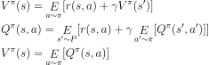
  
  Q(s,a) is Action-value Function and V(s) is value Function
  
- Advantage Functions

  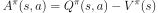

- Policy Gradient

  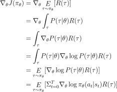

### Kinds of Algorithm

- Q-Learning

  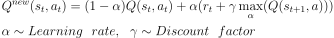
  
- Double Deep Q-Learning
  
  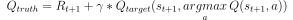
  
  use different nets to choose action and estimate action-value function
  
- Dueling Deep Q-Learning

  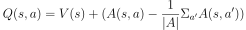

- A2C \ A3C

  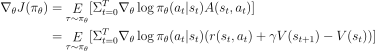

- TD3 (Twin Delayed DDPG)

  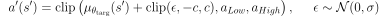

  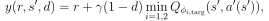

  

- TRPO

  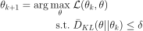

  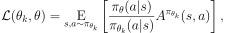

  Find the relation between two policy

  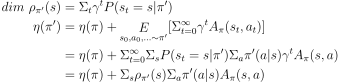

  - Trick 1

    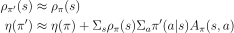

  - Tricks....

    prove a inequality and make the lower bound higher every time

  - Process

    find conjugate gradient and do a line search on the direction

- PPO

  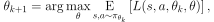
  
  - change KL constraint to Penalty
  - add clip to make each step smaller
  - make optimization easier
